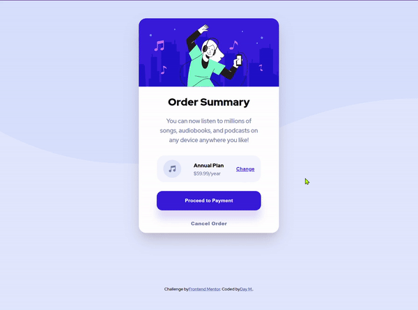

# Frontend Mentor - Order summary card solution

This is a solution to the [Order summary card challenge on Frontend Mentor](https://www.frontendmentor.io/challenges/order-summary-component-QlPmajDUj). Frontend Mentor challenges help you improve your coding skills by building realistic projects. 

## Table of contents

- [Overview](#overview)
  - [The challenge](#the-challenge)
  - [Gif](#gif)
  - [Links](#links)
  - [Built with](#built-with)
  - [What I learned](#what-i-learned)
  - [Useful resources](#useful-resources)
- [Author](#author)


## Overview

### The challenge

Users should be able to:

- See hover states for interactive elements

### Gif




### Links

- Solution URL: [Add solution URL here](https://your-solution-url.com)
- Live Site URL: [Add live site URL here](https://your-live-site-url.com)

### Built with

- Semantic HTML5 markup
- CSS custom properties
- Flexbox
- Mobile-first workflow

### What I learned

I found it difficult to center my card and place the footer element at the bottom of my viewport. I'm happy with this part of the code because it was a great solution to the problems I described above. 

```css
body {
    background-color: var(--Primary-Pale-blue);
    background-image: url('./images/pattern-background-desktop.svg');
    background-repeat: no-repeat;
    display: flex;
    flex-direction: column;
    font-family: 'Red Hat Display', sans-serif;
    font-size: 14px;
    height: 100vh;
    justify-content: space-between;
    line-height: 1.6;
    margin: 0 auto;
    max-width: 375px;
    padding: 3rem 0;
}
```

### Useful resources

- [Create an animate Gif](https://ezgif.com/maker) - GIF maker allows you to instantly create your animated GIFs by combining separated image files as frames.
- [Convert from HEX to HSL value](https://htmlcolors.com/hex-to-hsl) - I wanted to use hsl values, I used this app to convert HEX values to HSL.

## Author

- Frontend Mentor - [@daymrz](https://www.frontendmentor.io/profile/LeilyD)
- Twitter - [@dayMrz_](https://twitter.com/DayMrz_) 

